## Description About The Project

---

- The fourth project of Gitti Gidiyor Java Spring Bootcamp by patika.
- Database of a school management system has been created. 
  
- H2 is used as the database system.
  
- The connection of the project with h2 is made using Spring Data Jpa.
  
- Querying, updating and deleting operations can be performed With Spring Boot Get, Post, Put and Delete mapping.
  
- The design of the project was made in accordance with the UML diagram.
  
- Swagger was used to perform Get, Post, Put and Delete mapping operations.

- DTO(Data Transfer Object) is used as request and response object.

- Thrown errors are logged in the database.

### School Management System UML Diagram

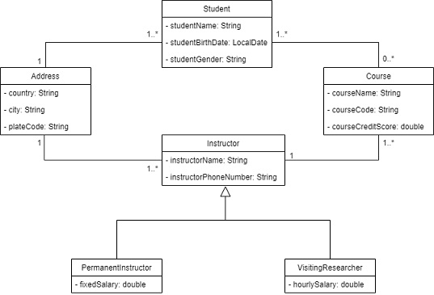

### Built With

- Java Spring Boot
- Spring Data JPA
- H2 Database
- Mapstruct
- Swagger

## Getting Started

---

### Installation

1. Clone the repo

` git clone https://github.com/113-GittiGidiyor-Java-Spring-Bootcamp/fourth-homework-TasdemirTolunay.git `

2. If you have maven available in your local, for mapper operations to occur :

` mvn install `

3. If you don't have maven in your local, intellij idea program is easy to perform "maven install". When the project is opened with Intellij idea, click on the text maven on the right side of the screen, double-click on the "install" statement in the lifecycle.

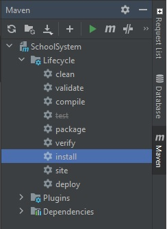

## Usage

---
- When you run the project, you can perform mapping with swagger. The url used for Swagger is:
  
http://localhost:8080/swagger-ui.html

- example usages are given on the student controller. 
- Similar operations apply to address, course and instructor controllers.

- Mapping operations applicable to the student :

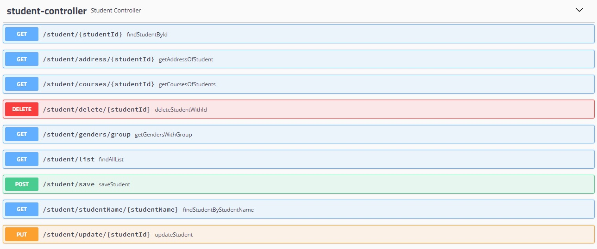

- Get mapping for get student with id :

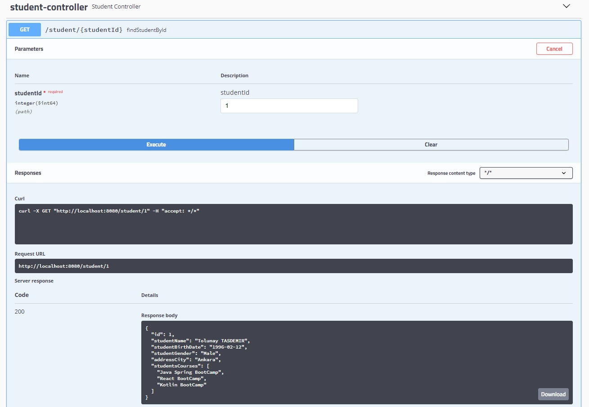

- Get mapping for courses the student is enrolled in :

- Post mapping for save a student :

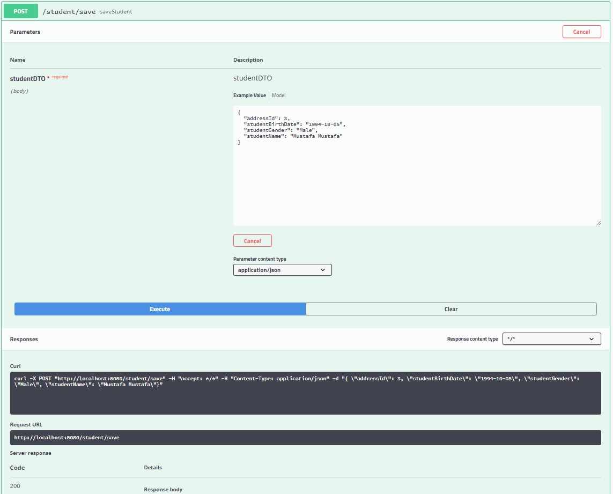

- Put mapping for update a student :

- The student with ID number 2 has been updated.

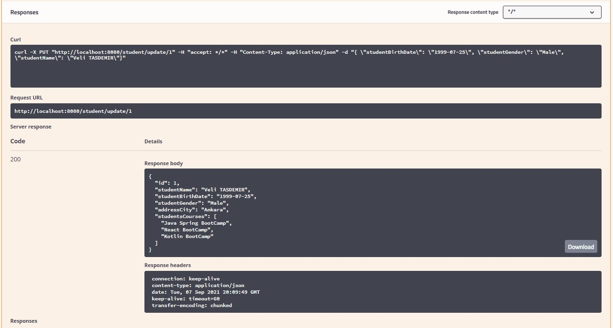

- Delete mapping for delete a Student in database :

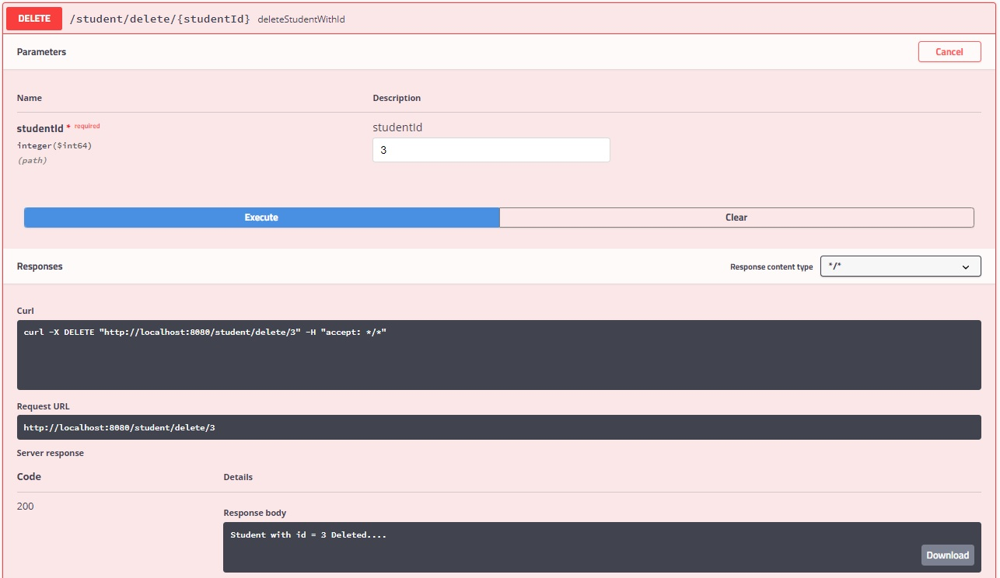

### Some Exceptions In the Project

- An exception is thrown if attempting to save student age less than 18 or greater than 40.

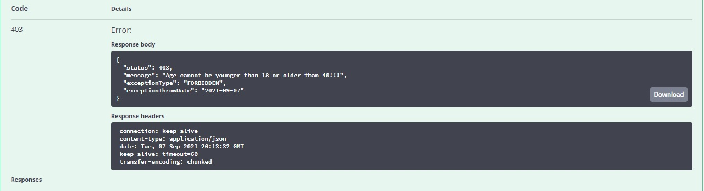

- There cannot be 2 separate instructors with the same phone number in the system. If it is defined, an exception is thrown.

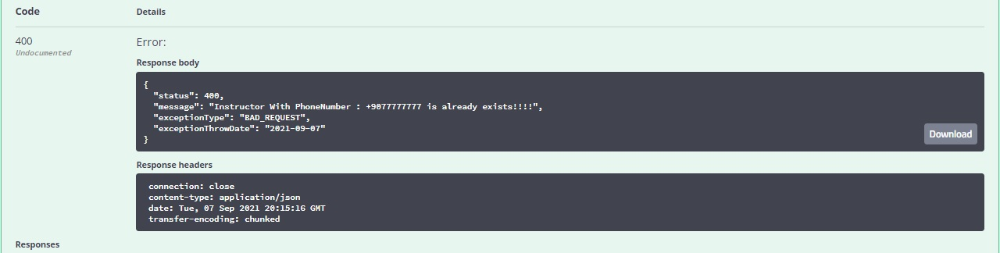

- There cannot be 2 separate courses with the same course code in the system. If defined, an exception is thrown.

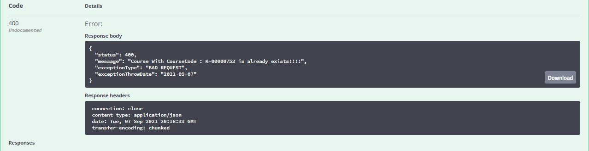

- A maximum of 20 students can take a course at the same time. Otherwise an exception is thrown.

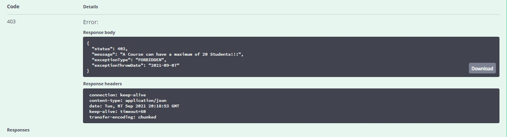

- Exceptions thrown in the system are kept in the database with their type, status code, thrown date and message thrown.
- Thrown exceptions can be queried by type, status code, date thrown or the all exception list can be queried.

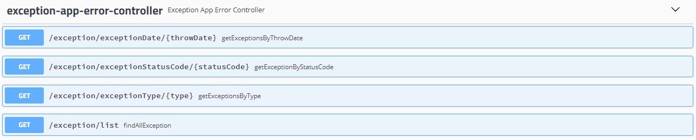

## Contact

---

- Tolunay TASDEMIR  https://www.linkedin.com/in/tolunay-tasdemir

### Fourth Project

